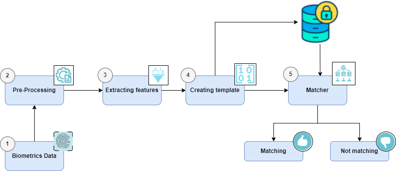

# 🧑‍💻 Biometric System 

## 📂 Project Structure
- **bio-backend**: The Spring Boot server responsible for biometric data processing, user authentication, and communication with the MySQL database.
- **client-module**: Software for the physical device that captures fingerprints and communicates with the server.
- **registration-module**: The admin panel for managing users, devices, buildings, and rooms, as well as monitoring and analyzing access logs.


## 📋 Requirements
Before setting up and running the system, the following requirements must be met:

- **MegaMatcher SDK**: A valid license for MegaMatcher SDK is required for biometric data processing.
- **Docker**: Docker is needed for containerizing and running certain parts of the application (e.g., the database and the Spring Boot server).
- **Raspberry Pi 4B with peripherals**: The hardware for capturing fingerprint data (listed below in 🖥️Device section).
- **Futronic FS80 Fingerprint Scanner**: The fingerprint scanning device.
- **MySQL Database**: For storing user and biometric data.

## 📜 Description

This project implements a **person identification system** based on fingerprint images using a **client-server architecture**. The project includes a physical device built with a **Raspberry Pi microcomputer**, connected to a **fingerprint scanner**, an **electromagnetic lock**, a **buzzer**, and an **LCD screen**. The device is used for capturing fingerprint scans and controlling access to rooms. 

Additionally, a **Spring Boot** application server has been deployed, which is responsible for **user identification** based on biometric features using the **MegaMatcher SDK 13** software. An **administrator panel** was also created to manage system resources, including **users**, **devices**, **buildings**, and **rooms**.

## 🖥️ Device

The device consists of the following components:
- **Raspberry Pi 4B**
- **Futronic FS80 Scanner**
- **Electromagnetic Lock**
- **16x2 LCD Screen**
- **Buzzer**
- **Relay**

### ⚙️ Functionality

The device is designed to:
- **Collect biometric data** (fingerprints).
- **Transmit data** to the server for **user identification**.

It runs on **RaspbianOS**, and the software controlling the scanner and transmitting the data is written in **C**. The C code also handles peripherals such as the LCD screen and buzzer.

### 🗂️ File Structure and Device

Below is the file structure of the device's software and hardware:

  
*Figure 1: File structure*

  
*Figure 2: Device for collecting and sending biometrics data*

## 💻 Server

The server is the central component of the entire system. It runs on the **Spring Boot** framework, which ensures easy configuration and fast application startup. It is responsible for processing and comparing biometric data using **MegaMatcher SDK** software and for communication with the **MySQL database** (Fig. 3). 

All data exchanged between the server, client, and database is encrypted using **AES-256**, both during transmission and storage.

### 📦 Database Structure Overview

### 🧑 User
Stores personal data and user roles.  
Roles:
- `ADMIN`: Has access to the admin panel.
- `USER`: Regular system user.

### 🧬 Fingerprint
Stores biometric data for each user.  
Fields:
- `token`: Encrypted fingerprint features.
- `original_image`: Encrypted raw fingerprint image.
- `type`: Finger type (`THUMB`, `INDEX`, `MIDDLE`).
- `user_id`: Foreign key linking to the `user` table (1:N relationship).

### 🏢 Building
Stores building information.  
Fields:
- `number`: Building number.
- `address`: Building address.

### 🖥️ Device
Registered fingerprint scanning devices.  
Fields:
- `mac_address`: Unique hardware identifier.
- `scanner_serial_number`: Device serial number.

### 🚪 Room
Represents rooms in buildings and their associated devices.  
Relationships:
- `building_id`: Links to `building` (1:N).
- `device_id`: Links to `device` (1:1).

### 📋 Enrollment
Logs access attempts.  
Useful for:
- Access tracking.
- Detecting unauthorized attempts.
- Analyzing usage history.

### 🔗 Users_Rooms
Junction table for many-to-many (`N:N`) relation between `user` and `room`, allowing flexible access rights.

---

The server also handles biometric data processing with the MegaMatcher SDK. It preprocesses the received fingerprint images, generates templates from them, and conducts the identification process (Fig. 4).
Based on the identification results, the system determines whether access should be granted or denied, controlling the electromagnetic lock to allow or block entry into the room.


*Figure 3: ERD Diagram*


*Figure 4: Server data processing*

## ⚙️ Admin Panel

The admin panel has been designed and created with efficiency and effectiveness in mind for system management.

Through the application, administrators can:
- Manage users and their roles.
- Register and manage scanning devices.
- Configure buildings and rooms within the system.
- Monitor and analyze entry logs to rooms (access statistics).

Below are example screenshots from the GUI of the admin panel:


*Figure 5: Collecting biometric data process*


*Figure 5: User's Uncofirmed Enrollments By Finger Type*

## 🖼️ Fingerprint Image Acquisition Process

The scanning process is simple and intuitive. The system randomly selects a finger for scanning and displays it on the screen (1). Then, the user approaches the scanning device and places the indicated finger on the scanner (2). After scanning, the user should remove the finger from the scanner and observe the screen. 

### 🔑 Successful Identification (3.1)
If the identification is successful, the following actions occur:
1. A success message appears on the screen.
2. A sound is generated by the buzzer.
3. The electromagnetic lock opens.

### 🚫 Failed Identification (3.2)
If the identification fails, the user will receive a message indicating an unsuccessful attempt to access the room. The system will then randomly select another finger for scanning.

The process is illustrated in Figure 5 below.

  
*Figure 5: Fingerprint Image Acquisition Process*

## 🚀 Run

To run the system server, you can use **Docker** and **Docker Compose**. Follow these steps:

1. **Build and start the server**:
   - In the server project directory (bio-backend), run the following command to start the server and its dependencies (such as the MySQL database):

   ```bash
   docker compose up